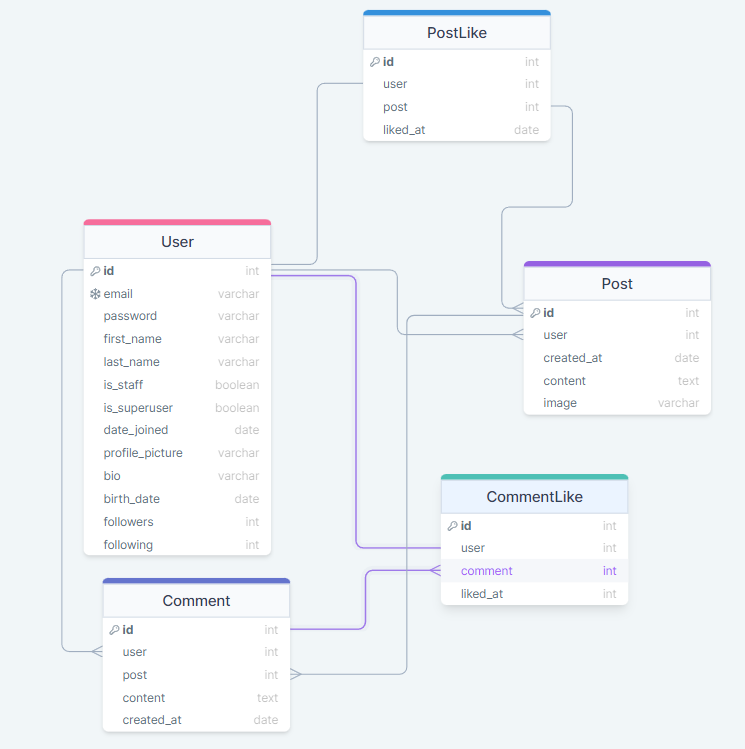

# Social-Media-API

### Database structure

## How to run:

- `git clone https://github.com/gleblitvinenko/Social-Media-API.git`
- `cd social_media_api`
- `python -m venv venv`
#### Windows:
`venv\Scripts\activate`
#### Linux/macOS:
`source venv/bin/activate`
- Copy .env.sample -> .env and populate with all required data
- `pip install -r requirements.txt`
- `python manage.py makemigrations`
- `python manage.py migrate`
- `python manage.py createsuperuser`
- `python manage.py runserver`